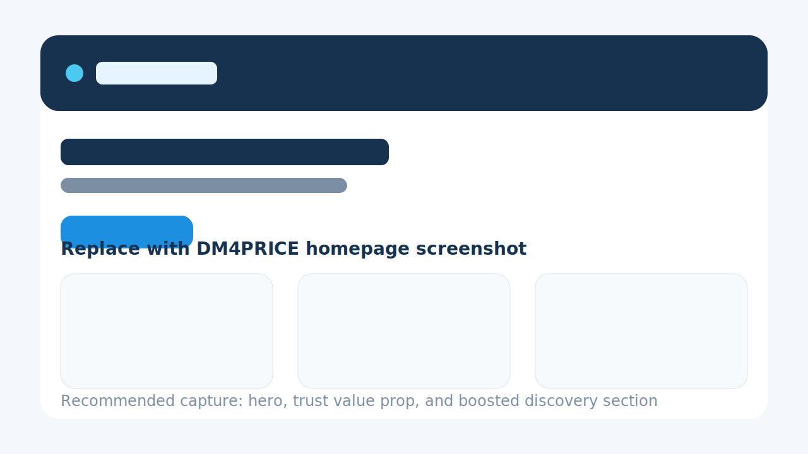
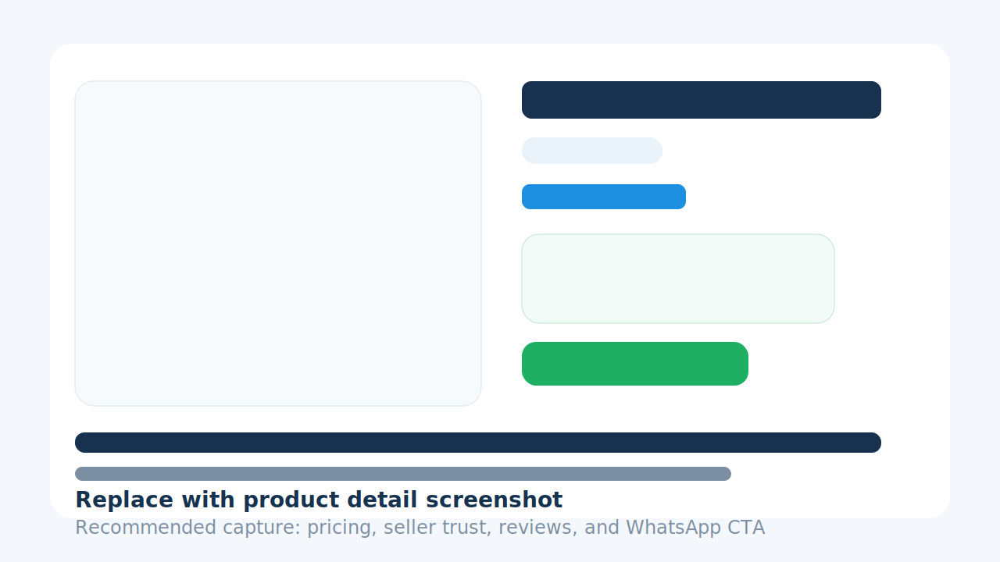
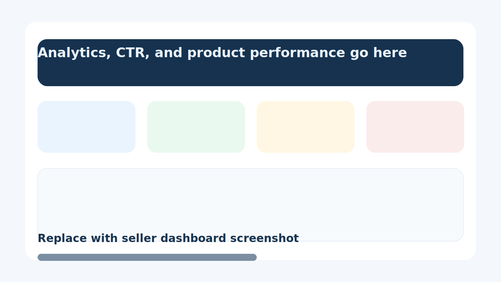

# DM4PRICE

DM4PRICE is a Django marketplace built for price discovery, safer seller interactions, and measurable conversion performance.

[](https://www.python.org/)
[](https://www.djangoproject.com/)
[](https://github.com/Eelblitz/d4p/blob/main/LICENSE)
[](https://github.com/Eelblitz/d4p)

[](https://render.com/deploy?repo=https://github.com/Eelblitz/d4p)

## Overview

DM4PRICE helps buyers compare listings more confidently and helps sellers prove what is actually working.

- Ranked discovery with boosted listings, ratings, and recency signals
- Verified seller trust markers and reporting flows
- Product and seller reviews
- Seller dashboard with views, WhatsApp clicks, and CTR analytics
- Promotion support with measurable ROI signals

## Feature Highlights

- Buyer search by keyword, category, and price range
- Product detail pages with tracked contact intent
- Seller dashboard for listing management and engagement performance
- Promotion ranking logic for boosted product visibility
- Admin-ready trust and safety building blocks

## Screenshots

These placeholders are ready to swap with real screenshots as the product evolves.

| Homepage | Product Detail | Seller Dashboard |
| --- | --- | --- |
|  |  |  |

Recommended real screenshots to replace them with:

- Homepage showing boosted listings and trust-first positioning
- Product detail page showing pricing, seller trust, and WhatsApp CTA
- Seller dashboard showing views, contact clicks, and promotion ROI

## Tech Stack

- Python 3.10+
- Django 5.2
- SQLite for local development
- PostgreSQL for production
- WhiteNoise for static files in production
- Gunicorn + Uvicorn worker for Render

## Local Setup

1. Clone the repository.
2. Create a virtual environment.
3. Install dependencies.
4. Copy `.env.example` to `.env`.
5. Run migrations.
6. Start the server.

```powershell
git clone https://github.com/Eelblitz/d4p.git
cd d4p
python -m venv venv
.\venv\Scripts\activate
pip install -r requirements.txt
Copy-Item .env.example .env
python manage.py migrate
python manage.py runserver
```

App URL:

- Home: `http://127.0.0.1:8000/`
- Admin: `http://127.0.0.1:8000/admin/`

## Environment Variables

Start with `.env.example` and adjust the values you need:

- `SECRET_KEY`
- `DEBUG`
- `ALLOWED_HOSTS`
- `CSRF_TRUSTED_ORIGINS`
- `DATABASE_URL`
- `EMAIL_BACKEND`
- `EMAIL_HOST`
- `EMAIL_PORT`
- `EMAIL_USE_TLS`
- `EMAIL_HOST_USER`
- `EMAIL_HOST_PASSWORD`
- `DEFAULT_FROM_EMAIL`

## Testing

Run the focused product suite:

```powershell
python manage.py test products
```

Run the full suite:

```powershell
python manage.py test
```

## Branch Workflow

This repository uses a safer branch-based workflow:

- `main`: stable, release-ready code
- `develop`: integration branch for approved work
- `feature/<name>`: new features
- `fix/<name>`: non-urgent bug fixes
- `hotfix/<name>`: urgent production fixes

Recommended flow:

```powershell
git checkout develop
git pull
git checkout -b feature/my-change
```

After work is complete:

```powershell
git add .
git commit -m "Describe the change"
git push -u origin feature/my-change
```

Then open a pull request into `develop`. Merge `develop` into `main` when you want to release.

More guidance lives in [`CONTRIBUTING.md`](CONTRIBUTING.md).

## Deploying to Render

This repo now includes both a `build.sh` script and a `render.yaml` blueprint, so you can deploy either with a one-click Blueprint flow or by configuring the service manually.

### Option 1: Blueprint Deploy

1. Push the latest code to GitHub.
2. In Render, open **Blueprints** and create a new Blueprint instance.
3. Select this repository.
4. Render will read [`render.yaml`](render.yaml) and provision:
   - a Python web service
   - a PostgreSQL database
5. Apply the Blueprint and wait for the first deploy to finish.

### Option 2: Manual Render Setup

1. Create a new PostgreSQL database in Render.
2. Create a new **Web Service** connected to this GitHub repository.
3. Set the runtime to **Python 3**.
4. Use these commands:

```bash
Build Command: ./build.sh
Start Command: python -m gunicorn config.asgi:application -k uvicorn.workers.UvicornWorker
```

5. Add these environment variables in Render:

- `SECRET_KEY`: generate a secure value in Render
- `DATABASE_URL`: use the internal database URL from your Render Postgres instance
- `WEB_CONCURRENCY`: `4`
- `PYTHON_VERSION`: `3.10.11`
- `DEBUG`: `False`

### What the Render Files Do

- [`build.sh`](build.sh): installs dependencies, collects static files, and runs migrations
- [`render.yaml`](render.yaml): defines the web service and database as infrastructure-as-code

### Post-Deploy Checklist

After the first successful deploy:

1. Open the Render Shell.
2. Create a superuser:

```bash
python manage.py createsuperuser
```

3. Visit `/admin/` and confirm admin login works.
4. Test product creation, image uploads, and tracked seller contact clicks.

### Important Production Note

The current app stores uploaded media on the local filesystem. That is fine for local development, but production image uploads on Render should eventually move to persistent object storage such as Cloudinary, Amazon S3, or another external media store.

## License

This project is licensed under the MIT License. See [`LICENSE`](LICENSE).
